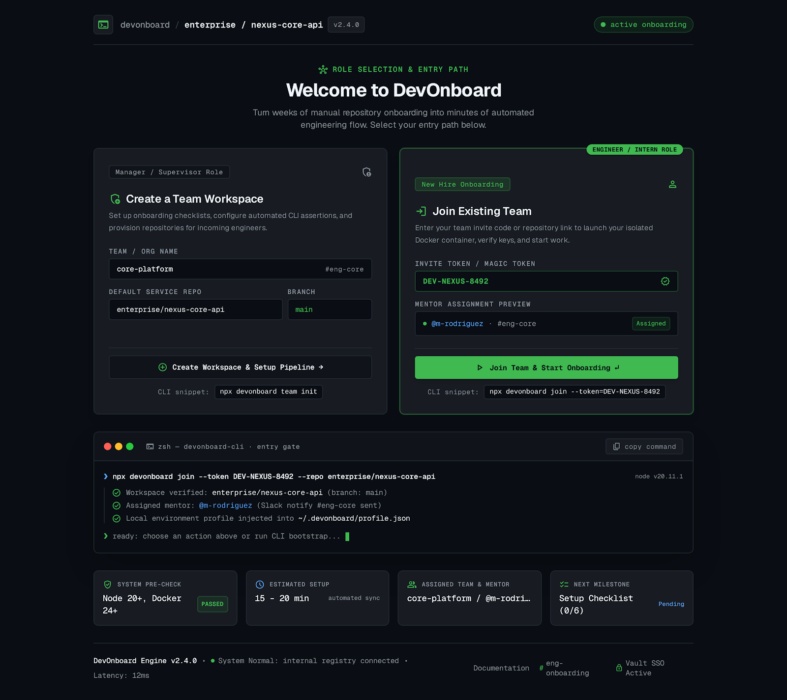
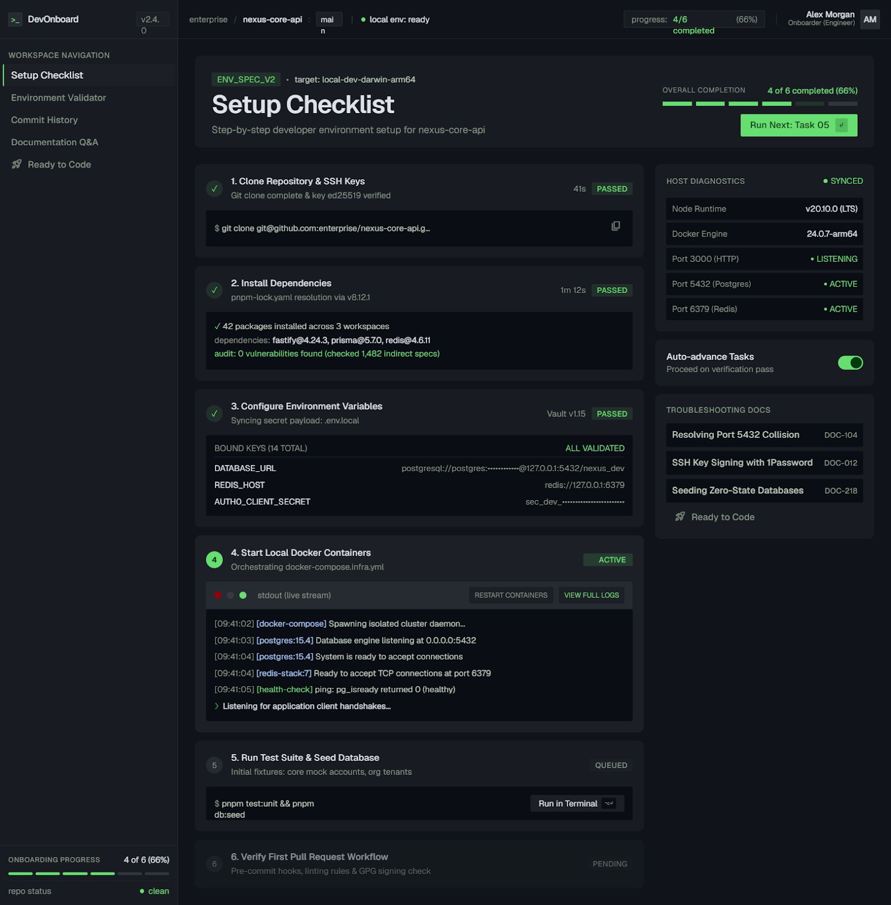
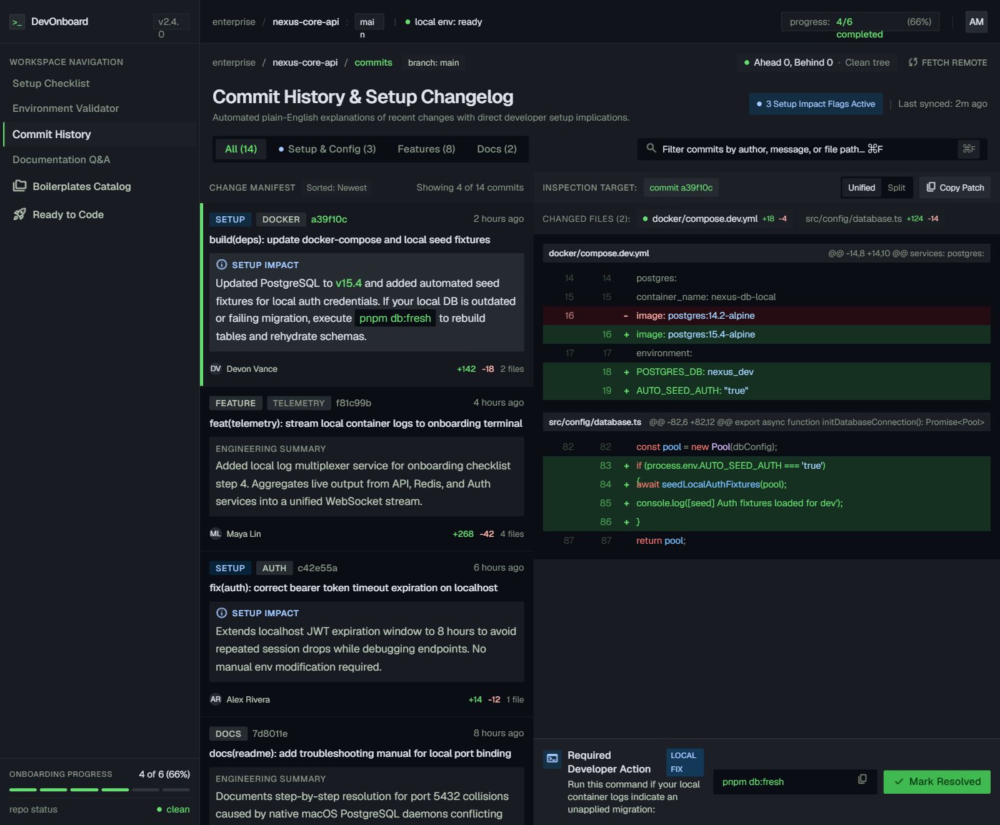
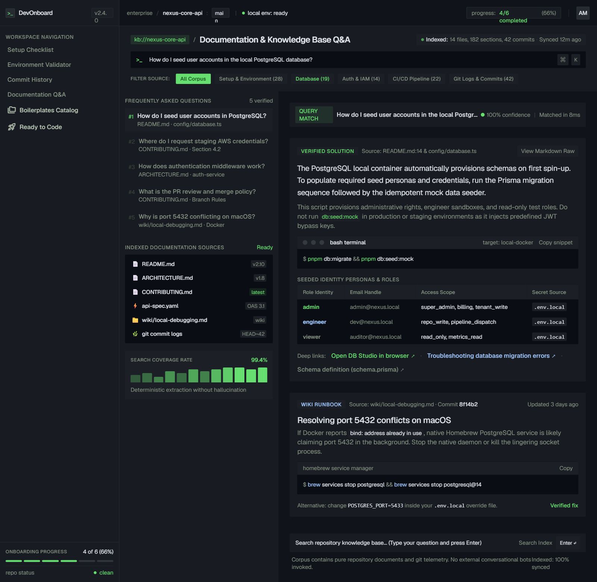
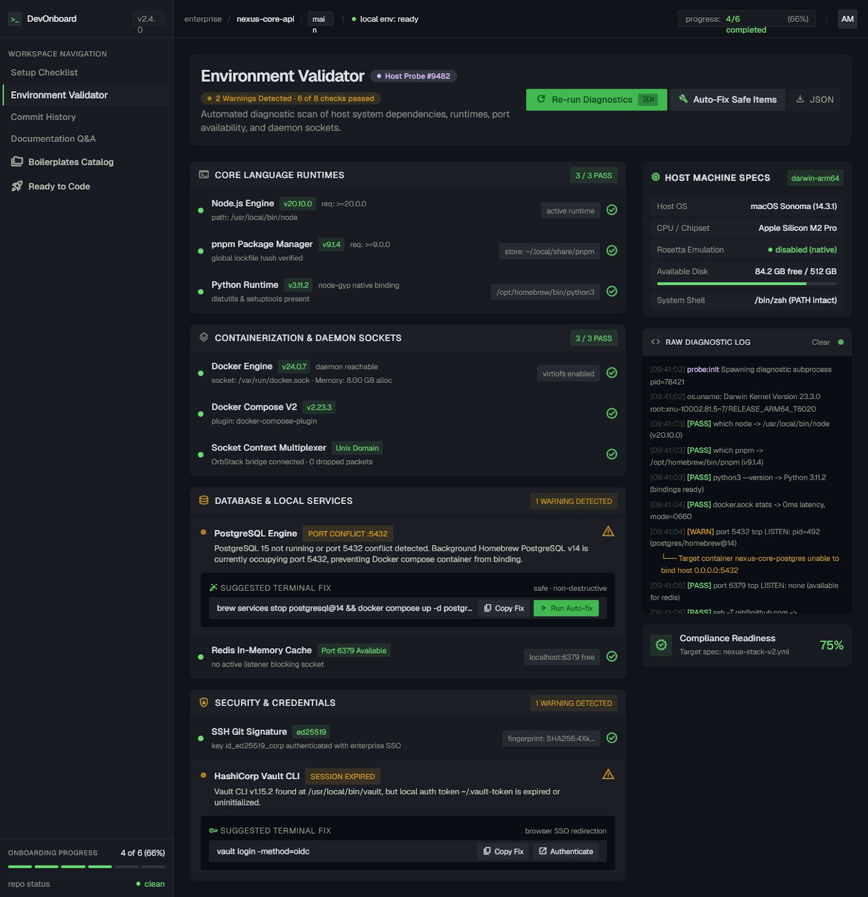
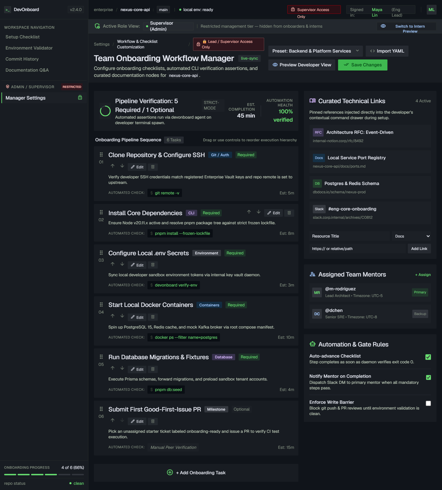

# DevOnboard

> AI-assisted developer onboarding copilot — turn weeks of manual repo setup into minutes of automated engineering flow.

Built for **IBM Bob 2.0 Agents**. DevOnboard guides new engineers through environment setup, commit history, documentation Q&A, and environment validation — all from a single React dashboard.

---

## Screenshots

| Welcome | Setup Checklist | Commit History |
|---|---|---|
|  |  |  |

| Docs Q&A | Environment Validator | Manager Settings |
|---|---|---|
|  |  |  |

---

## Features

- **Welcome & Role Selection** — engineers join via invite token; managers create team workspaces
- **Setup Checklist** — 6-step guided environment setup with live terminal output and progress tracking
- **Commit History** — filterable commit feed with diff inspector and plain-English setup-impact explanations
- **Documentation Q&A** — searchable knowledge base with verified answers, code snippets, and param tables
- **Environment Validator** — automated health checks with one-click auto-fix and JSON export
- **Manager Settings** — drag-reorder workflow tasks, edit via modal form, configure presets
- **Onboarding Completion** — readiness ring, verified badges, first-issue assignment, mentor contact

---

## Quick Start

### Prerequisites

- [Node.js](https://nodejs.org/) v20+
- npm v9+ (comes with Node)

### Run locally

```bash
# 1. Clone
git clone https://github.com/your-org/devonboard.git
cd devonboard

# 2. Install dependencies
cd devonboard-app
npm install

# 3. Start dev server
npm run dev
```

Open [http://localhost:5173](http://localhost:5173).

### Build for production

```bash
cd devonboard-app
npm run build        # outputs to devonboard-app/dist/
npm run preview      # serve the production build locally
```

### Type check

```bash
cd devonboard-app
npm run typecheck
```

---

## Environment Variables

Copy `.env.example` to `.env` and fill in the values. These apply to any future backend/CI integration layer — the static app does not require them to run.

```bash
cp .env.example .env
```

See [`.env.example`](.env.example) for all documented variables (GitHub token, Slack webhook, Vault SSO URL).

---

## Project Structure

```
devonboard/
├── devonboard-app/          # React + TypeScript application (Vite)
│   ├── src/
│   │   ├── components/
│   │   │   ├── layout/      # AppShell (sidebar + nav)
│   │   │   └── ui/          # Button, Badge, Card, Terminal, CopyButton, Toast, Input
│   │   ├── pages/           # One file per screen (7 screens)
│   │   ├── lib/utils.ts     # cn() helper
│   │   └── App.tsx          # Router + layout
│   ├── tailwind.config.ts   # Design tokens (colors, type, spacing, radius)
│   └── package.json
│
├── boilerplates/            # Original static HTML reference screens (read-only)
│   ├── welcome_devonboard/
│   ├── setup_checklist_devonboard/
│   ├── commit_history_devonboard/
│   ├── documentation_q_a_devonboard/
│   ├── environment_validator_devonboard/
│   ├── manager_settings_devonboard/
│   ├── onboarding_completion_devonboard/
│   └── technical_precision_dark/DESIGN.md   # Canonical design system
│
├── .env.example             # Environment variable documentation
├── AGENTS.md                # AI agent guidance (see also .bob/rules-*/)
└── LICENSE
```

---

## Tech Stack

| Layer | Technology |
|---|---|
| Framework | React 19 |
| Language | TypeScript (strict) |
| Build tool | Vite 8 |
| Styling | Tailwind CSS v3 |
| Routing | React Router v7 |
| Icons | Lucide React |
| Fonts | Geist + Geist Mono (Google Fonts CDN) |

---

## Design System

All colors, typography, spacing, and component specs originate from [`boilerplates/technical_precision_dark/DESIGN.md`](boilerplates/technical_precision_dark/DESIGN.md) and are codified in [`devonboard-app/tailwind.config.ts`](devonboard-app/tailwind.config.ts).

**Key palette:**
- Canvas: `#0a0e14` · Card: `#181c22` · Border: `#262c36`
- Primary / git-green: `#3fb950` · Blue: `#58a6ff` · Amber: `#d29922` · Red: `#f85149`
- Text: `#f0f6fc` · Muted: `#8b949e`

---

## Route Map

| Route | Screen |
|---|---|
| `/` | Welcome (role selection) |
| `/setup` | Setup Checklist |
| `/commits` | Commit History |
| `/docs` | Documentation Q&A |
| `/validator` | Environment Validator |
| `/manager` | Manager Settings |
| `/complete` | Onboarding Completion |

---

## Contributing

1. Fork the repository
2. Create a feature branch: `git checkout -b feat/DOT-XXXX-short-description`
3. Read [`AGENTS.md`](AGENTS.md) for coding conventions before making changes
4. Run `npm run typecheck` before committing
5. Open a pull request — the PR template will auto-populate from commit messages

---

## License

[MIT](LICENSE) © 2025 DevOnboard Contributors
